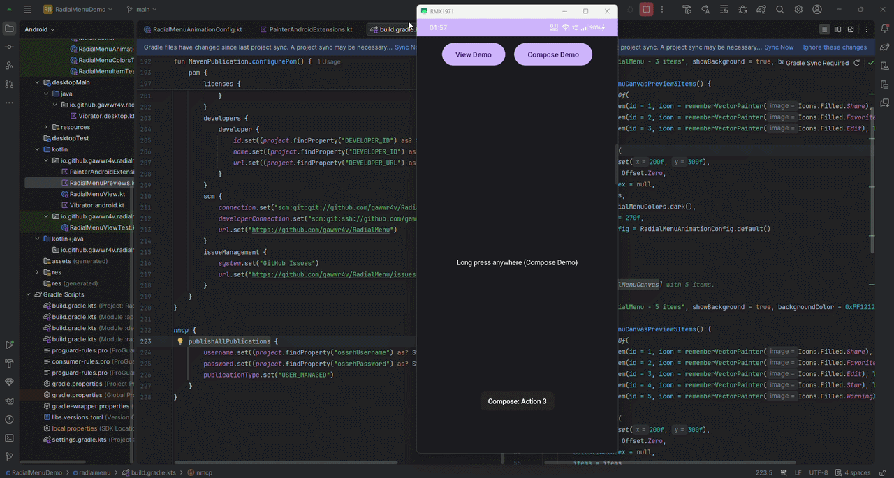
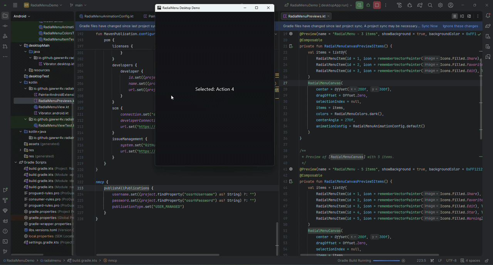

<div class="homepage-hero">
  
  <h1>RadialMenu</h1>
  <p class="tagline">Radial context menu for Compose Multiplatform and Android Views</p>
</div>

```kotlin title="Dependency"
implementation("io.github.gawwr4v:radialmenu:1.0.4")
```

<div align="center" style="margin: 3rem 0; display: flex; justify-content: center; gap: 3rem; flex-wrap: wrap;">
  <div style="text-align: center;">
    
    <div style="font-size: 0.9rem; color: var(--md-default-fg-color--light);">Android</div>
  </div>
  <div style="text-align: center;">
    
    <div style="font-size: 0.9rem; color: var(--md-default-fg-color--light);">Desktop JVM</div>
  </div>
</div>

## What You Get

- Compose wrapper + fullscreen overlay API
- Android View API (`RadialMenuView`)
- Trigger modes: `Auto`, `LongPress`, `SecondaryClick`, `KeyboardHold`
- Edge-hug corner layout (opt-in)
- Badge support, active/inactive item icons, and animated hover scaling

## Trigger Model

- `Auto` picks platform defaults:
  - Android: `LongPress(positionAware = true)`
  - Desktop: `SecondaryClick(positionAware = false)`
- `KeyboardHold(key)` opens at screen center and commits selection on key release.
- Keyboard hold selection uses angle-based pie slices and tracks flick direction from cursor position at key-down.

## Behavior Notes

- Edge-hug layout is opt-in through `enableEdgeHugLayout = true`.
- Edge-hug applies only to cursor/touch-spawned menus in corners with 4+ items.
- Edge-hug is skipped for center-spawned keyboard menus.
- Published POM declares only `kotlin-stdlib`; Compose and AndroidX are provided by the consuming app.

## Next

- [Getting Started](getting-started.md)
- [Customization](customization.md)
- [Radial vs Circular vs Pie](alternatives.md)
- [Changelog](changelog.md)
